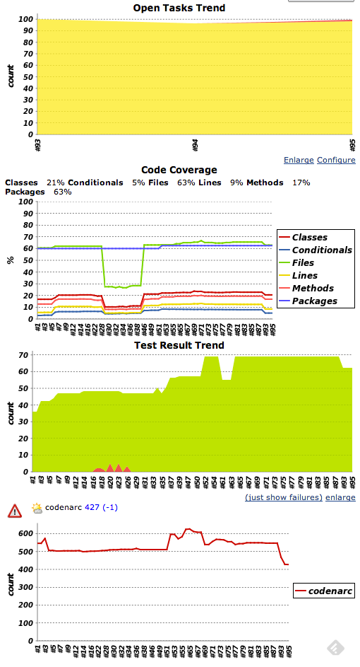
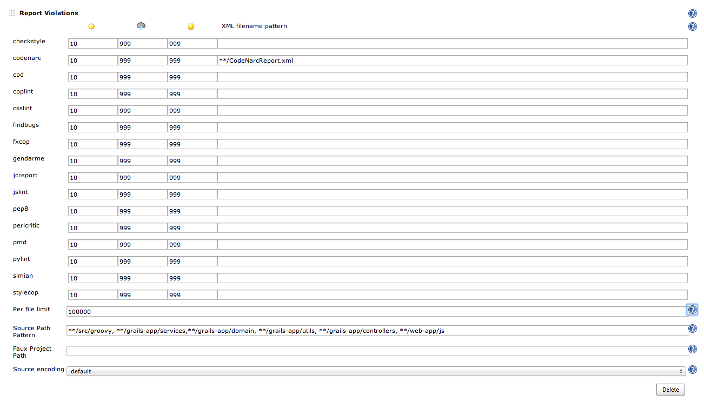
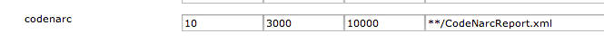
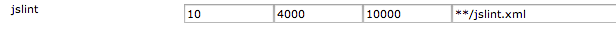
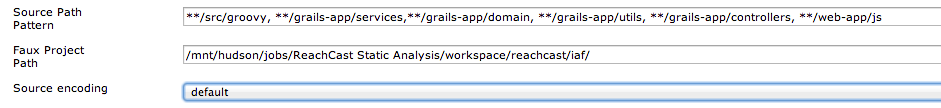
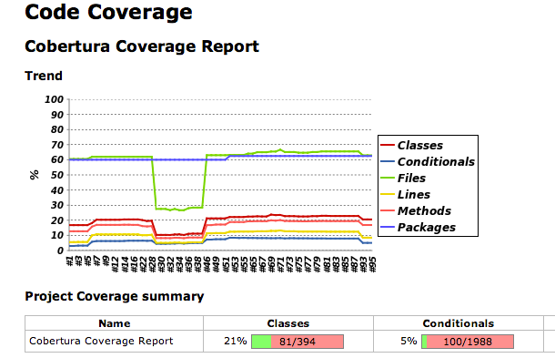
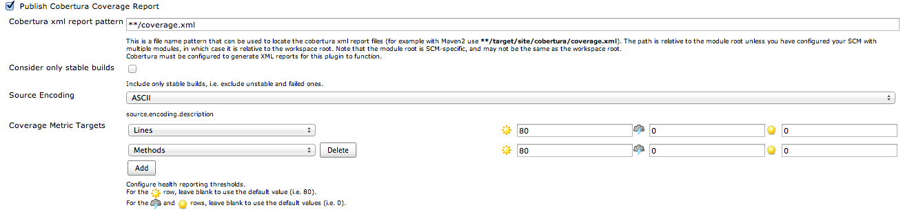
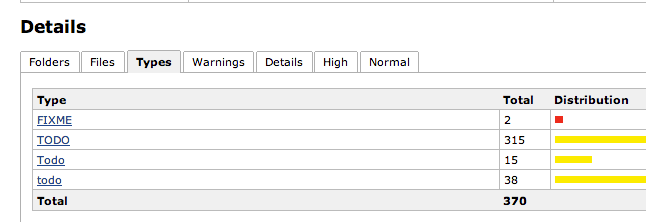
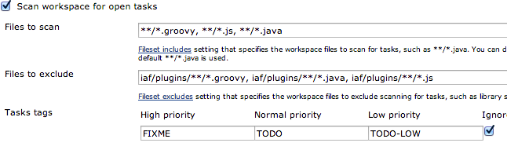

## Agenda

* What is Static Analysis
* What it Catches
* What it Misses
* The Tools
* Jenkins
* Dealing with Old Code
~~~~
## What is Static Analysis

Information about your code that is properties of your code. Mostly obtained by looking at your code statically not looking at runtime or dynamic data.
~~

## What it Catches

Items there are 'easy' rules to enforce.
~~
## EmptyCatchBlock

    def myMethod() {
        try {
            doSomething
        } catch(MyException e) {     //violation
            // should do something here
        }
    }
~~
## Missing Triple Equals

In JavaScript doing: 

	if(x==y)

vs

	if(x===y)
    
~~~~
## What it misses

The architectural decisions you have made. For example choosing to always use mixins for adding shared functionality to controllers vs using inheritance. Just architectural flaws in general.
~~
## What it misses

In general these tools are not going to help you from doing something silly like having a great distributed system that that all depends on a single MySQL node.
~~~~
## The Tools 

  * CodeNarc
  * Cobertura
  * JSLint
~~~~
## CodeNarc

"CodeNarc analyzes Groovy code for defects, bad practices, inconsistencies, style issues and more." - [CodeNarc](http://codenarc.sourceforge.net/)
~~
## CodeNarc - Plugin

There is a grails plugin that you can use to give you CodeNarc. BuildConfig:

	plugins {
      compile ":codenarc:0.19"
      ...
    }
~~
## CodeNarc - My Standard Config

	codenarc.processTestUnit = false
	codenarc.processTestIntegration = false
	codenarc.propertiesFile='grails-app/conf/codenarc.properties'
	codenarc.ruleSetFiles = "rulesets/basic.xml,rulesets/exceptions.xml, rulesets/imports.xml,rulesets/grails.xml, rulesets/unused.xml, rulesets/size.xml, rulesets/concurrency.xml,rulesets/convention.xml,rulesets/design.xml,rulesets/groovyism.xml,rulesets/imports.xml,rulesets/logging.xml"
    
	codenarc.reports = {
		MyXmlReport('xml') {               // The report name "MyXmlReport" is user-defined; Report type is 'xml'
			outputFile = 'target/test-reports/CodeNarcReport.xml'  // Set the 'outputFile' property of the (XML) Report
			title = 'CodeNarc'             // Set the 'title' property of the (XML) Report
		}
		MyHtmlReport('html') {             // Report type is 'html'
			outputFile = 'target/test-reports/CodeNarcReport.html'
			title = 'CodeNarc HTML'
		}
	}
~~
## CodeNarc - Config for Rules

I use the properties file for adjusting individual rules.

	GrailsPublicControllerMethod.enabled=false
	CatchException.enabled=false
	CatchThrowable.enabled=false
	ThrowException.enabled=false
	ThrowRuntimeException.enabled=false
	GrailsStatelessService.enabled=false
	NestedBlockDepth.maxNestedBlockDepth=3

You will want the first line as it is the work around for [GPCODENARC-30](http://jira.grails.org/browse/GPCODENARC-30)
	
~~
## CodeNarc - Additional Dependencies

Some rules will need some extra config, adding GMetrics will allow many rules of the size.xml file to work.

    dependencies {
      compile 'org.gmetrics:GMetrics:0.6'
      ...
    }
~~
## CodeNarc - Suppress False Positives

Use an annotation to suppress any false positives

    @SuppressWarnings('DuplicateStringLiteral')
      class MyClass {
      	def x = 'x'
      	def y = 'x'
      }
~~~~
## Cobertura

A code coverage tool for the jvm, used via the code coverage grails plugin.

[Code Coverage](http://grails.org/plugin/code-coverage)

	plugins {
      test ":code-coverage:1.2.6"
      ...
    }
~~
## Cobertura - Config

In BuildConfig.groovy you can set up exclusions like the following:

    coverage {
	  exclusions = [
	    '**/radar/**',
        '**/FacebookConfig*'
        ]
    }
~~
## Cobertura - Running

Most of the time you will be running this on the CI which you should be passing the xml flag.

    grails test-app -coverage -xml
~~
## Cobertura - Warnings

* Report 100% coverage for one build
* Underreport branch coverage
* Underreport overall coverage
~~~~
## CodeNarc + Cobertura

[C.R.A.P. Metric](http://www.artima.com/weblogs/viewpost.jsp?thread=210575) With both CodeNarc and Cobertura we can get the CRAP metric working.
~~
## CRAP Meteric

In the codenarc.properties file set the following:

    CrapMetric.coberturaXmlFile=file:target/test-reports/cobertura/coverage.xml
~~~~
## JSLint

*Warning*: JSLint will hurt your feelings. - [JSLint](http://www.jslint.com/lint.html)

JavaScript plays a big part of most web applications so we need to treat it with the same rigor as our Groovy code.
~~
## JSLint - Config

In a JSLintConfig.groovy file

	jslint.options = "white"
	jslint.directory = "web-app/js"
	jslint.includes = "**/*.js"
	jslint.excludes = "**/*.min.js, **/i18n/**/*.js, **/prototype/*.js,**/*-min.js,**/*.pack.js"
	jslint.haltOnFailure = false
	jslint.preDef = "\$"
	jslint.reports = {

		MyXmlReport('xml') {                    // The report name "MyXmlReport" is user-defined; Report type is 'xml'
			destfile = 'target/test-reports/jslint.xml'  // Set the 'outputFile' property of the (XML) Report
		}
		MyHtmlReport('report') {                  // Report type is 'html'
			destfile = 'target/test-reports/jslint.html'
		}
	}
~~~~
## Other Tools

* [CSSLint](http://csslint.net/)
* [JSHint](http://www.jshint.com/) - _Nicer JSLint_
* [SCSS Lint](https://github.com/causes/scss-lint)
~~~~
## Jenkins

Use Jenkins paired with a number of plugins to really trend and deal with all this information.

* [Violations](https://wiki.jenkins-ci.org/display/JENKINS/Violations)
* [Cobertura Plugin](https://wiki.jenkins-ci.org/display/JENKINS/Cobertura+Plugin)
* [Task Scanner Plugin](https://wiki.jenkins-ci.org/display/JENKINS/Task+Scanner+Plugin)
~~
## Jenkins

~~~~
## Violations

This will parse JSLint and CodeNarc xml files allowing us to trend the number of warnings. It will group the type of violation into high, normal, and low priorities. 

The plugin also allows us to set acceptable levels of violations.
~~
## Violations - Config

~~
## Violations - Config

~~~~
## Cobertura Jenkins Plugin

~~
## Cobertura Jenkins Plugin - Config

~~~~
## Task Scanner 

~~
## Task Scanner - Config

~~~~
## Dealing with Old Code

* Set a Baseline
* Pick your Battles
* Keep the Signal
~~
## Setting a Baseline

In Jeknins you see sunny, stormy, or yellow ball. Sunny is great while stormy is there is something wrong while yellow is considered unstable.

* Sunny - Where you want your project in the short term
* Stormy - Where you are now or what you consider bad
* Yellow Ball - Slightly lower than the current state to prevent you from regressing
~~
## Pick your battles

Turn off rules that are too hard to fix at this time or you have already made a decision that is against a rule. 
~~
## Keep the Signal

Look for general trends. As well as cutting out any junk from the tools.
